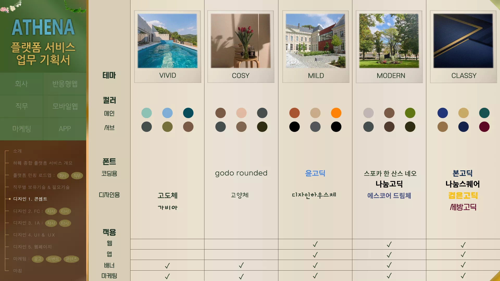

---
layout: single
title: "첫 포스팅 글"
---

# 오늘 처음 블로그를 만들었습니다.

파이팅입니다.

## ✨ ABOUT ME ✨

- 👩🏻‍💻 Developer

### 

## **🛠️Teck Stack🛠️**

📕Language 

   

**📒Backend ** 

**📓DB 
**     

**📗Collaboration 
**  

## ⚒ FE SKILLS ⚒

### 

